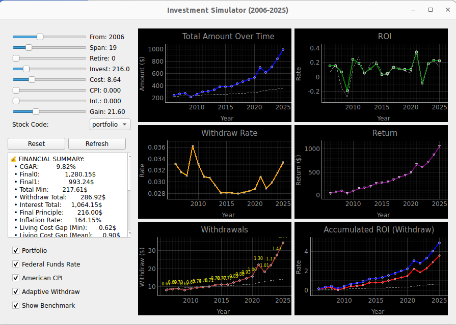

# Investment Simulator

A comprehensive investment simulation tool that helps model long-term retirement planning scenarios. This application provides a graphical interface to experiment with different investment strategies, withdrawal rates, and market conditions.

## Features

- **Portfolio-based investing**: Simulate investments across multiple asset classes
- **Real market data**: Uses historical data for S&P 500, NASDAQ, Berkshire Hathaway, and Gold
- **Adaptive withdrawal strategies**: Dynamic withdrawal rates based on portfolio performance
- **Inflation adjustment**: Incorporates real CPI data and Federal Funds Rate
- **Interactive visualization**: Real-time charts showing portfolio growth and sustainability

## Default Portfolio Allocation

The simulator uses a balanced portfolio approach with equal weighting across major asset classes:

| Asset | Symbol | Allocation | Description |
|-------|--------|------------|-------------|
| Berkshire Hathaway Class B | BRKB | 25% | Value investing approach |
| NASDAQ Composite | NASDAQ | 25% | Technology-focused growth |
| S&P 500 | SP500 | 25% | Broad market exposure |
| Gold ETF | GLD | 25% | Inflation hedge and diversification |

